<!--
  ============================================================================
  Abdullah Nadeem Lodhi — GitHub Profile README
  ----------------------------------------------------------------------------
  This file must live in a public repo named exactly the same as your GitHub
  username: abdullah-nadeem-lodhi/abdullah-nadeem-lodhi
  See SETUP.md in this package for the full activation checklist.
  ============================================================================
-->

<div align="center">



<br/>

<!-- Animated typing intro (Readme Typing SVG) -->
<a href="https://github.com/abdullah-nadeem-lodhi">
  
</a>

<br/>

<!-- Quick badges -->
<a href="https://www.linkedin.com/in/abdullah-nadeem-lodhi-650016314">
  
</a>
<a href="mailto:TODO_your_email@example.com">
  
</a>
<a href="https://github.com/abdullah-nadeem-lodhi?tab=repositories">
  
</a>



</div>

<!-- ==========================================================================
     ABOUT ME
     ========================================================================== -->

### 🧭 About Me

I'm **Abdullah Nadeem Lodhi**, a Software Engineering student at **Lahore Garrison University** (2024–2028) and a full‑stack web developer working primarily in the **MERN stack**. I like taking an idea from a blank file to a working, polished interface — clean UI, sensible structure, and code that's easy to come back to later.

Right now I'm focused on strengthening my full-stack fundamentals through coursework and side projects, while gradually expanding into applied AI tooling and automation.

```txt
const abdullah = {
  role: "Software Engineering Student & Full-Stack Developer",
  university: "Lahore Garrison University (2024 – 2028)",
  stack: ["React", "Node.js", "Express", "MongoDB", "Tailwind CSS", "JavaScript"],
  currentlyLearning: ["AI-assisted engineering", "Prompt Engineering", "System Design"], // TODO: refine as skills grow
  location: "Pakistan",
  funFact: "Enjoys building small interactive tools (games, clocks, UI experiments) just to learn by shipping"
};
```

<br/>

<!-- ==========================================================================
     CURRENT ROLE / EXPERTISE
     ========================================================================== -->

### 💼 Current Role & Expertise

<table>
<tr>
<td width="50%" valign="top">

**🎓 Education**
Software Engineering (BS), Lahore Garrison University
`2024 — 2028`

**🛠️ Core Focus**
Full-Stack Web Development · MERN Stack
Building responsive, functional, production-style projects

</td>
<td width="50%" valign="top">

**📍 Based in**
Pakistan

**🌱 Growing In**
AI-assisted development, prompt engineering, automation workflows
<sub>TODO — link a project here once published</sub>

</td>
</tr>
</table>


<!-- ==========================================================================
     TECH STACK
     ========================================================================== -->

### 🧰 Tech Stack

<div align="center">

**Languages & Core**


**Frontend**


**Backend & Data**


**Tools & Platforms**


<!-- TODO: add/remove icons as your stack evolves — full list at https://skillicons.dev -->

</div>


<!-- ==========================================================================
     FEATURED PROJECTS
     ========================================================================== -->

### 🚀 Featured Projects

<table>
<tr>
<td width="50%" valign="top">

**[🎬 Netflix Clone](https://github.com/abdullah-nadeem-lodhi/netflix-clone-by-abdullah)**
A front-end recreation of the Netflix browsing experience — practicing layout, hero banners, and content-row UI patterns common to real streaming products.

`HTML` `CSS` `JavaScript`

</td>
<td width="50%" valign="top">

**[🛒 Cara E-Commerce](https://github.com/abdullah-nadeem-lodhi/Cara-Ecommerce)**
Modern e-commerce landing page with a responsive hero section, product grid/carousel, hover-zoom effects, and quantity selectors — built with vanilla JS for smooth, dependency-free interactions.

`HTML` `CSS` `JavaScript`

</td>
</tr>
<tr>
<td width="50%" valign="top">

**[🎮 Neon Tic-Tac-Toe](https://github.com/abdullah-nadeem-lodhi/Neon-TicTacToe)**
A fully functional Tic-Tac-Toe game with turn-based play, win/draw detection, a restart flow, and real-time status — wrapped in a responsive neon cyberpunk visual style.

`JavaScript` `HTML` `CSS`

</td>
<td width="50%" valign="top">

**[🕐 Analogue Clock](https://github.com/abdullah-nadeem-lodhi/Analogue-Clock-JS)**
A real-time analogue clock rendered on HTML Canvas, using `setInterval` and the `Date` object to drive smooth hand animations — minimal, responsive, and dependency-free.

`JavaScript` `HTML Canvas` `CSS`

</td>
</tr>
</table>

<div align="center">
<sub>More projects and write-ups are on the way — this section grows as new repos ship.</sub>
</div>


<!-- ==========================================================================
     AI ENGINEERING
     ========================================================================== -->

### 🤖 AI Engineering

<!--
  TODO: This section is a placeholder. No AI/ML repositories were publicly
  visible on the profile at the time this README was generated. Replace the
  content below once you publish AI-related work (LLM tooling, agents,
  prompt-engineering experiments, automation scripts, etc.).
-->

> Currently exploring applied AI engineering — integrating LLM APIs into web apps, experimenting with prompt design, and building small automation scripts to speed up everyday development tasks.

- 🔬 **In progress:** `TODO — add your first AI-integration project`
- 🧪 **Interests:** LLM-powered features, prompt engineering, workflow automation
- 📌 Once a project is public, replace this block with a project card matching the *Featured Projects* format above.


<!-- ==========================================================================
     FULL-STACK DEVELOPMENT
     ========================================================================== -->

### 🏗️ Full-Stack Development

My day-to-day stack is the **MERN stack** — React on the front end, Node/Express on the back end, and MongoDB for storage — styled with Tailwind CSS for fast, consistent UI work.

| Layer | Tools |
|---|---|
| **Frontend** | React, Tailwind CSS, HTML5, CSS3, JavaScript (ES6+) |
| **Backend** | Node.js, Express.js |
| **Database** | MongoDB `· TODO: add SQL experience here if applicable` |
| **Tooling** | Git, GitHub, VS Code, Postman |
| **Deployment** | `TODO — Vercel / Netlify / Render, once a project is deployed` |

Recent hands-on work spans UI-heavy front-end builds (see *Featured Projects*) and coursework projects covering software construction & design (`SCDProjectsAndTasks`) and version-control workflows (`Lab6VC`).


<!-- ==========================================================================
     UI / UX DESIGN
     ========================================================================== -->

### 🎨 UI/UX Design

I care about how a project *feels* to use, not just whether it works. Projects like **Neon Tic-Tac-Toe** and **Cara E-Commerce** were built with deliberate attention to hover states, responsiveness, and visual consistency — small details that make an interface feel finished.

- Responsive, mobile-first layouts
- Micro-interactions (hover states, transitions, real-time UI feedback)
- Consistent visual language across a project
- `TODO — add Figma/design-tool links here if you formalize a design workflow`


<!-- ==========================================================================
     GITHUB STATS
     ========================================================================== -->

### 📊 GitHub Stats

<div align="center">


<br/>


</div>


<!-- ==========================================================================
     ACTIVITY GRAPH
     ========================================================================== -->

### 📈 Contribution Activity

<div align="center">


</div>


<!-- ==========================================================================
     CONTRIBUTION SNAKE
     ========================================================================== -->

### 🐍 Contribution Snake

<!--
  Generated by .github/workflows/snake.yml using Platane/snk.
  These URLs point at the "output" branch that the workflow creates on its
  first run — no manual upload needed after the workflow runs once.
-->

<div align="center">

<picture>
  <source media="(prefers-color-scheme: dark)" srcset="https://raw.githubusercontent.com/abdullah-nadeem-lodhi/abdullah-nadeem-lodhi/output/github-contribution-grid-snake-dark.svg" />
  <source media="(prefers-color-scheme: light)" srcset="https://raw.githubusercontent.com/abdullah-nadeem-lodhi/abdullah-nadeem-lodhi/output/github-contribution-grid-snake.svg" />
  
</picture>

</div>


<!-- ==========================================================================
     TROPHIES
     ========================================================================== -->

### 🏆 GitHub Trophies

<div align="center">


</div>


<!-- ==========================================================================
     EXTENDED METRICS (optional — lowlighter/metrics)
     ========================================================================== -->

<details>
<summary><b>📐 Extended Metrics (optional, click to expand)</b></summary>
<br/>

Generated by <code>.github/workflows/metrics.yml</code> using
<a href="https://github.com/lowlighter/metrics">lowlighter/metrics</a>. Requires a
<code>METRICS_TOKEN</code> secret — see the workflow file for setup notes.

<div align="center">

</div>

</details>


<!-- ==========================================================================
     VISITOR COUNTER
     ========================================================================== -->

<div align="center">


</div>


<!-- ==========================================================================
     CONTACT & SOCIALS
     ========================================================================== -->

### 📫 Contact & Socials

<div align="center">

<a href="https://www.linkedin.com/in/abdullah-nadeem-lodhi-650016314">
  
</a>
<a href="mailto:TODO_your_email@example.com">
  
</a>
<a href="https://TODO-your-portfolio-site.example.com">
  
</a>
<a href="https://twitter.com/TODO_handle">
  
</a>

<!-- TODO: fill in real email / portfolio URL / Twitter (or remove badges you don't use) -->

</div>


<!-- ==========================================================================
     FOOTER
     ========================================================================== -->

<div align="center">
<sub>Designed & built with care · Last refreshed manually — keep this profile growing alongside your projects 🚀</sub>
</div>
